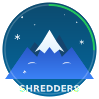

# Shredders 🏔️

AI-powered mountain conditions tracker for powder chasers. Real-time snow data, weather forecasts, and intelligent powder day predictions for Mt. Baker and PNW ski resorts.



## Features

- **Real-time Conditions** - Live snow depth, temperature, and wind data from SNOTEL
- **7-Day Forecast** - Weather predictions from NOAA National Weather Service
- **Powder Score (1-10)** - AI-calculated daily powder rating based on multiple factors
- **AI Summaries** - Natural language conditions reports powered by Claude
- **Historical Data** - 30/60/90 day snow depth charts
- **iOS App** - Native SwiftUI companion app with home screen widgets

## Live Demo

**Web App**: [shredders-bay.vercel.app](https://shredders-bay.vercel.app)

## API Endpoints

| Endpoint | Description |
|----------|-------------|
| `/api/conditions` | Current snow depth, temps, wind from SNOTEL |
| `/api/forecast` | 7-day weather forecast from NOAA |
| `/api/powder-score` | Calculated powder score with factors |
| `/api/history?days=30` | Historical snow depth data |
| `/api/summary` | AI-generated conditions summary |
| `/api/mountains/[mountainId]/roads` | Road & pass conditions (WA via WSDOT, optional) |
| `/api/mountains/[mountainId]/trip-advice` | Heuristic crowd/traffic/road risk + suggested timing |
| `/api/mountains/[mountainId]/powder-day` | 3-day powder day planner (forecast + travel context) |

## Data Sources

- **SNOTEL** (Wells Creek 910:WA:SNTL) - Snow depth, SWE, temperature
- **NOAA NWS** (api.weather.gov) - Weather forecasts
- **Claude AI** - Natural language summaries

## Tech Stack

### Web App
- Next.js 14+ (App Router)
- TypeScript
- Tailwind CSS
- Recharts

### iOS App
- SwiftUI
- Swift 6
- Swift Charts
- WidgetKit

### Backend
- Vercel (hosting)
- SNOTEL REST API
- NOAA Weather API
- Anthropic Claude API

## Getting Started

### Prerequisites
- Node.js 18+
- npm or yarn
- Xcode 15+ (for iOS app)

### Installation

```bash
# Clone the repo
git clone https://github.com/yourusername/shredders.git
cd shredders

# Install dependencies
npm install

# Run development server
npm run dev
```

Open [http://localhost:3000](http://localhost:3000) to view the web app.

### iOS App

```bash
# Navigate to iOS project
cd ios/PowderTracker

# Generate Xcode project (requires xcodegen)
xcodegen generate

# Open in Xcode
open PowderTracker.xcodeproj
```

## Environment Variables

For AI summaries, set your Anthropic API key:

```bash
ANTHROPIC_API_KEY=your_key_here
```

Optional (Washington road & pass conditions via WSDOT Traveler Info API):

```bash
WSDOT_ACCESS_CODE=your_access_code_here
```

## Project Structure

```
shredders/
├── src/
│   ├── app/
│   │   ├── api/              # API routes
│   │   │   ├── conditions/
│   │   │   ├── forecast/
│   │   │   ├── powder-score/
│   │   │   ├── history/
│   │   │   └── summary/
│   │   └── page.tsx          # Main dashboard
│   ├── components/           # React components
│   ├── lib/apis/             # API clients (NOAA, SNOTEL, Claude)
│   └── types/                # TypeScript types
├── ios/
│   └── PowderTracker/        # SwiftUI iOS app
├── public/
│   ├── logo.svg
│   └── icon.svg
└── package.json
```

## Powder Score Algorithm

The powder score (1-10) is calculated from:

| Factor | Points | Condition |
|--------|--------|-----------|
| Fresh Snow | +1 to +3 | Based on 24hr snowfall |
| Temperature | +1 to +2 | Cold temps = light powder |
| Wind | 0 to -2 | High wind penalty |
| Base Depth | +1 | 80"+ base bonus |
| Incoming Storm | +1 | 6"+ expected |

## License

MIT

## Acknowledgments

- NRCS for SNOTEL data
- NOAA for weather forecasts
- Mt. Baker Ski Area for being legendary
